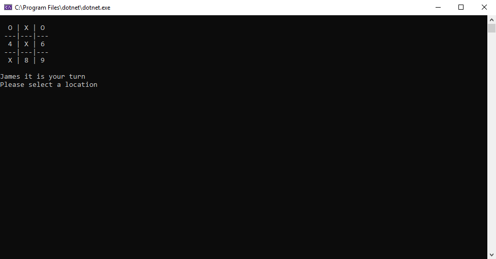

# Lab04-Tic-Tac-Toe
**Author**: Benjamin Taylor  
**Version**: 1.0.0

## Overview
A command-line game of Tic-Tac-Toe for 2 players.

## Getting Started
1. Create a fork of this repository, and clone your fork to your device.
2. Open the solution file `Lab04_TicTacToe` in Visual Studio.
3. To run the app, go to `Debug` > `Start Without Debugging` (or press Ctrl+f5).
4. For testing, navigate to the `TicTacTests` project using the Solution Explorer.
5. To run the tests, go to `Tests` > `Run` > `All Tests` (or press Ctrl+R)

## Using The Application

1. Upon starting the application, each player will be asked to enter their name, starting with player one. Once both players names have been entered, the game will begin.
2. Each turn, the player will need to select a number between 1 and 9 to place a marker onto the game board.
The player will continue to be prompted for input until they enter a valid position that hasn't already been taken.
3. After each turn is taken, the board is updated to reflect the current state of the game. Once a player wins by placing three markers in a row, 
or all of the positions on the board have been taken, the game will end.
4. Once the game has reached its conclusion, the player will be asked if they wish to play again. To close the game, enter anything other than "y".

## Architecture
**Languages Used**:
- C# 7.3 (.NET Core 2.2)

Written with Visual Studio Community 2019.

## Change Log
- **03-04-2019 7:04PM** - Initial Version